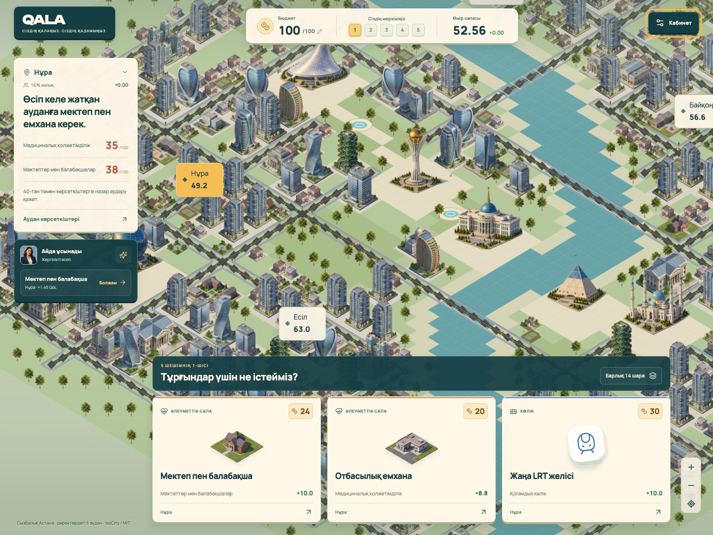
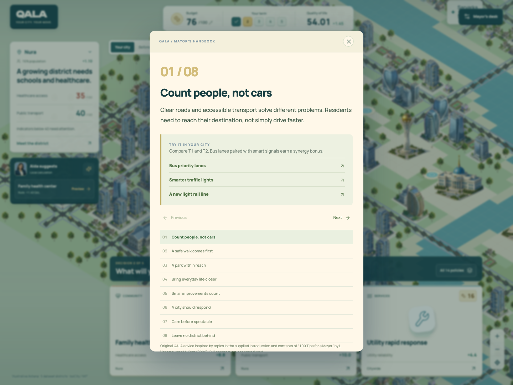

<div align="center">

# QALA

### Бір қала. Бес шешім.

**Офлайн жұмыс істейтін Астананы басқарудың кезекпен ойналатын симуляторы.**

[Русский](README.md) · [English](README.en.md) · [Қазақша](README.kk.md)

**100 бюджет · 5 шешім · 5 аудан · 14 шара · 3 тіл**



_Sauce Code · HackAlem AI 2026 · «5 сағатқа әкім» · Astana Innovations_
</div>

## Қала — бұл адамдар

Саябақ салу оңай шешім болып көрінеді. Бірақ сол жер мектепке де қажет, жаңа ауданда емхана жетіспейді, ал бюджет бес шешімге жетуі тиіс.

QALA қалалық көрсеткіштер кестесін түсінікті стратегиялық ойынға айналдырады. Аудандарды зерттеңіз, жоба карталарын таңдаңыз, салдарын алдын ала бағалаңыз. Соңында әр көрсеткішке дейін түсіндірілген **Astana Quality of Life Score** алыңыз.

Civilization ойынынан — аудандарды зерттеу. Balatro-дан — карталар мен синергия. Plague Inc-тен — көрнекі салдар. Есептеу берілген деректер жиынтығына сәйкес орындалады.

## 30 секундта бастаңыз

1. [play/QALA.html](play/QALA.html) файлын GitHub-тағы **Download raw file** батырмасымен немесе репозиторийдің ZIP мұрағатымен жүктеңіз.
2. Файлды заманауи браузерде ашыңыз. Орнату, интернет, аккаунт немесе API кілті қажет емес.
3. ҚАЗ тілін таңдаңыз, ауданды зерттеп, алғашқы шешімді қабылдаңыз.

Код, Canvas рендерері, стильдер, деректер және сурет бір HTML файлына енгізілген. Ойын алғаш ашылғанда да офлайн жұмыс істейді. Қала Canvas арқылы көрсетіледі және WebGL қажет етпейді. Браузер рұқсат етсе, ойын сақталады; нәтижені JSON түрінде экспорттауға болады.

Әзірлеу үшін Node.js 22.18+ қажет:

```bash
npm ci
npm run demo
```

```bash
npm run check       # Тесттер, TypeScript және жинақтау
npm run test:e2e    # Браузер, офлайн және мобильді тексерулер
npm run package    # Дайын play/QALA.html
```

Қажет болса, тест браузерін орнатыңыз: `npx playwright install chromium`. Интернет тәуелділіктерді орнатуға қажет, дайын ойынға қажет емес.

**http://localhost:8789** мекенжайын ашыңыз. `demo` ойынды жинақтап, қосымша AI қолдауы бар жергілікті серверді іске қосады. `.env` міндетті емес. Өзгерістерді бірден көру үшін `npm run dev` қолданып, терминалда көрсетілген мекенжайды ашыңыз.

**Coding agent үшін:** [AGENTS.md](AGENTS.md) файлынан бастаңыз. Онда іске қосу командалары, тексеру мәндері, модуль шекаралары және кілттермен жұмыс бар. [Іске қосу және ақауларды шешу](docs/RUNBOOK.md).

## QALA мүмкіндіктері

- IsoCity негізіндегі изометриялық көрініс: датасеттегі бес аудан, Астананың алты танымал ғимараты, көліктер, автобустар мен жаяу жүргіншілер қозғалысы, масштабтау және күн/түн режимі.
- Айдамен алғашқы қадамда үйрену: қажеттілікті таңдау → болжамды тексеру → шешім қабылдау → нәтижені түсіну. Нұсқаулықты өткізуге немесе қайталауға болады.
- Негізгі экранда қала, үш нұсқа және болжамға өтетін Айданың шағын кеңесі көрінеді. Кітап, тарих және баптаулар «Әкім кабинетінде» орналасқан.
- Сындарлы мәселелерді шешу, синергия және барлық ауданды жақсарту үшін жетістіктер беріледі. Олар балға жасырын бонус қоспайды.
- Әкім кітабы: ойын шараларымен байланысты сегіз төл кеңес.
- Бағасы, кідірісі, екі жылдық әсері және аудан таңдауы бар он төрт карта.
- Бес шешім, бюджет бақылауы, қайшылықтарды тексеру, соңғы шешімді қайтару және ойынды аяқтай алмайтын таңдаудан қорғау.
- Үш синергия: автобус жолағы + бағдаршам, жарық + өтініштер, таза отын + жасыл белдеу.
- Ашық есеп: орташа балл, ең әлсіз аудан, айыптар, барлық 50 көрсеткіш және әр шараның үлесі.
- Жергілікті кеңесші, онға дейін сценарий сақтау, салыстыру және JSON экспорты.
- Қазақша, орысша, ағылшынша интерфейс және қосымша LLM түсіндірмесі.

## Таныс Астана

[IsoCity](https://github.com/amilich/isometric-city) жобасының MIT лицензиясындағы нақты графикасы мен көрсету модульдері қолданылады. Қажетті файлдар офлайн жинаққа енгізілген, авторлық мәлімет сақталған. Хан Шатыр — Бәйтерек — Ақорда бағыты және Есіл арқылы Пирамидаға өту қала бейнесін танытады. [Интеграция мен лицензия](docs/ISOCITY.md) · [Географиялық бағдарлар](docs/ASTANA-MAP.md).

Бәйтерек, Ақорда, Хан Шатыр, Әзірет Сұлтан мешіті, Бейбітшілік және келісім сарайы, Нұр Әлем жеке ойын спрайттары ретінде салынған. Көліктер, автобустар мен жаяу жүргіншілер бірізді визуалды стильмен, байланысқан көшелер мен тротуарларда қозғалады. Өзен жағалауы, көпірлер, аулалар мен алаңдар қала көрінісін қалыптастырады. Жаңа ғимараттар аудан учаскелерінде пайда болады; шешімді қайтару бұрынғы құрылысты қалпына келтіреді. Көріністер шешімдерді бейнелейді, ал есептеу нәтижесі қайталанады.


Әкім кітабындағы кеңестер — Илья Варламов пен Максим Кацтың «100 советов мэру» (2020) кітабындағы тақырыптарға негізделген QALA-ның төл мәтіндері. Берілген үзіндіде толық тараулар емес, кіріспе мен мазмұн бар. Кітаптың PDF файлы репозиторийде жарияланбайды.



## Талдау және сценарий зертханасы

Аудан паспортында халық үлесі және он көрсеткіштің бастапқы/қазіргі мәндері көрсетіледі. Мәселелер графигі 40 шегіне дейінгі тапшылықты салыстырады; 5×10 матрица барлық мәнді сақтайды. Шепли үлестері синергия мен айыптарды шаралар арасында бөледі, олардың қосындысы жалпы Score өзгерісіне тең.

Кеңесшідегі жоспар іздеу әр қадамда 180 аралық нұсқаны сақтайды. Қабылданған шешімдер өзгермейді; ұсынысты алдымен қарап шығуға болады. Бұл дәлелденген жаһандық оптимум емес.

**Әкім кабинеті → Сценарий зертханасы** арқылы бюджетті 1–1 000, шешім санын 1–10 аралығында өзгертіңіз. Жаңа мәселе мен шараға атау, сипаттама, баға, кідіріс, қамту және оң/теріс әсерлер беруге болады. Лимит бұзылса да болжам көрінеді, ал қате анық түсіндіріледі.

Зертхана бөлек сақталады және экспортта белгіленеді. Конкурстық ойын **100 бюджет / 5 шешім** күйінде қалады; оның архиві мен AI келісімшарты өзгермейді. Өз әсерлеріңіз — авторлық жорамалдар. Командаластың `akim_5_hr` прототипінің идеялары пайдаланылды. [Интеграция шешімдері](docs/TEAM-INTEGRATION.md).

## Ашық ережелер

Барлық ойыншыға **100 бюджет** және бірдей синтетикалық деректер беріледі. **Дәл бес бірегей шара** қабылданады, бір бағытта екіден артық шара болмайды. Аудандық шараға аудан таңдалады; қалалық шара барлық аудандарға әсер етеді. Үйлесімсіздіктер автоматты тексеріледі. Қалған бюджет бонус бермейді.

Әр жүріс — шешім, өткен тоқсан емес. Барлық шараның мерзімі — сегіз тоқсан. Сондықтан шешімдер реті соңғы нәтижені өзгертпейді.

```text
Көрсеткіш = clip(база + Σ әсер × (8 − кідіріс) / 8 + синергия, 0, 100)
Аудан     = Σ көрсеткіш салмағы × көрсеткіш
Қала      = Σ халық үлесі × аудан балы
Score     = 0.7 × қала + 0.3 × ең әлсіз аудан − сындарлы көрсеткіштер саны
```

Сындарлы көрсеткіш — **40-тан қатаң төмен** мән. Синергия бонустары тұрақты, кідіріске қарай азаймайды. Ережеге сай емес сценарийге соңғы балл есептелмейді. Бес шешімге дейін тек болжам көрсетіледі.

Бастапқы балл — **52.55768**. Ұйымдастырушылар мысалы (`M7 Нұра, M8 Нұра, M10 Нұра, M12 қала, M5 Сарыарқа`) **95** тұрады және **56.54307** балл береді. Барлық сан бастапқы көрсеткіштерден есептеледі.

## Қалай жасалған және AI қайда қолданылады

**React + TypeScript + Vite + IsoCity Canvas.** `src/game/engine.ts` модулі шешімдерді тексеріп, барлық санды есептейді. Интерфейс пен карта осы нәтижені пайдаланады. Дерекқор немесе CDN қажет емес; қолданба бір HTML файлына жиналады.

**Офлайн кеңесші LLM емес, ережелерге негізделген.** Ол сындарлы көрсеткіштерді түсіндіреді және балды бірден арттыратын жарамды келесі қадамды ұсынады. Бұл жаһандық ең тиімді жоспардың дәлелі емес.

Jev және OpenAI қосу:

Сервер жұмыс істеп тұрса, **http://localhost:8789/#ai** ашыңыз: кілт формасы бірден көрінеді. Офлайн файлдағы **AI нұсқасын ашу** батырмасы жергілікті ойынды жаңа қойындыда ашады. Файл мен localhost сақтаулары бөлек. Серверді қайта іске қосудың қажеті жоқ.

Нұсқаулықта немесе кеңесші панелінде API кілтін қалауыңызша қосуға болады. Сессия кілті тек жергілікті сервер жадында сақталады; ажыратқанда немесе серверді қайта іске қосқанда өшеді. Ол браузер сақтауына, JSON не HTML файлына жазылмайды. Қосылу ақылы модельді бірден шақырмайды. Офлайн файлда жергілікті талдау қалады.

Әзірлеушілер `.env` қолдана алады:

```bash
cp .env.example .env
# TYPESAFE_API_KEY — Jev таңдауы; OPENAI_API_KEY — OpenAI түсіндірмесі.
# Кілттер тек .env ішінде, VITE_ префиксінсіз.
npm run demo
```

`http://localhost:8789` ашыңыз: **Әкім кабинеті → AI кеңесші → Кеңес алу**. Бір немесе екі қызметті қосуға болады. Jev тек есептелген жарамды нұсқалардың ішінен таңдайды, OpenAI салдарын түсіндіреді. Сервер мен браузер JSON Schema арқылы жауапты тексеріп, сандарды қозғалтқыштан қайта есептейді. Ұсыныс автоматты қабылданбайды. Қате болса, анық белгіленген жергілікті талдау қалады.

Әдепкі модельдер — `jev-1.13.0` және `gpt-4.1-mini`; оларды өзгертуге болады. Кілттер localhost серверінде қалады, офлайн файлға кірмейді. Jev сенімділігі нақты қалалық нәтиженің ықтималдығы емес. [Сегіз схема және тексеру шектеулері](docs/AI-CONTRACTS.md).

Интеграциялар жасанды жауаптармен тексерілген. Сіздің кілттеріңізсіз нақты ақылы сұраулар **тексерілмеген**. Сервер жергілікті демонстрацияға арналған.

## Тексеру және келесі қадамдар

Тесттер формуланы, ресми мысалды, кідірістерді, синергияларды, қайшылықтарды, 40 шегін, мысалдың барлық 120 ретін және қайталанатын 60 ойынды тексереді. Браузер тесттері бес шешімді қабылдайды, сақтауды, экспортты, мобильді интерфейсті, WebGL болмауын және интернетсіз алғашқы іске қосуды тексереді.

`npm run checkpoint` жобаны тексеріп, аяқталған өзгерістерді командалық репозиторийге жібереді. Бос коммиттер мен force-push қолданылмайды.

Деректер синтетикалық, карта нақты аудан шекараларын көрсетпейді. Бұл нақты Астана болжамы емес, оқу моделі. Келесі қадамдар: зертханадағы кездейсоқ оқиғалар, нақты GIS қабаттары және ортақ нәтижелер кестесі.

[Бес сағаттық жоспар](docs/PLAN.md) · [Модель](docs/MODEL.md) · [Қазыларға демо](docs/DEMO.md) · [Бастапқы деректер](docs/supplied-dataset.ru.txt)
