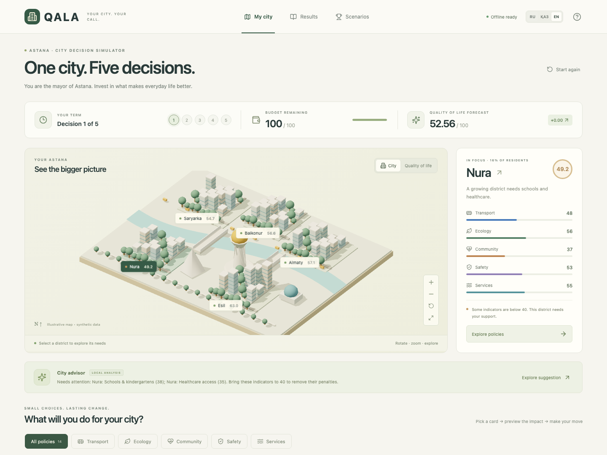
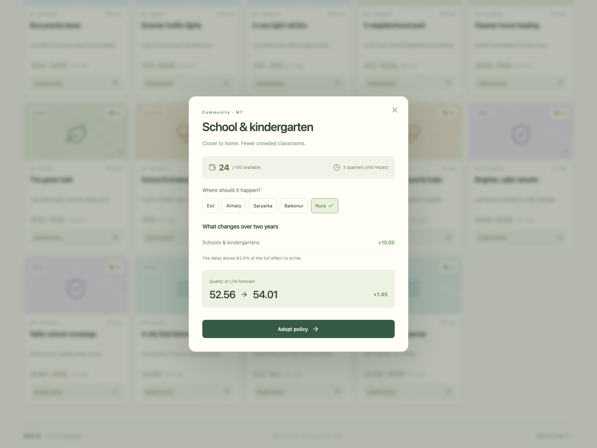
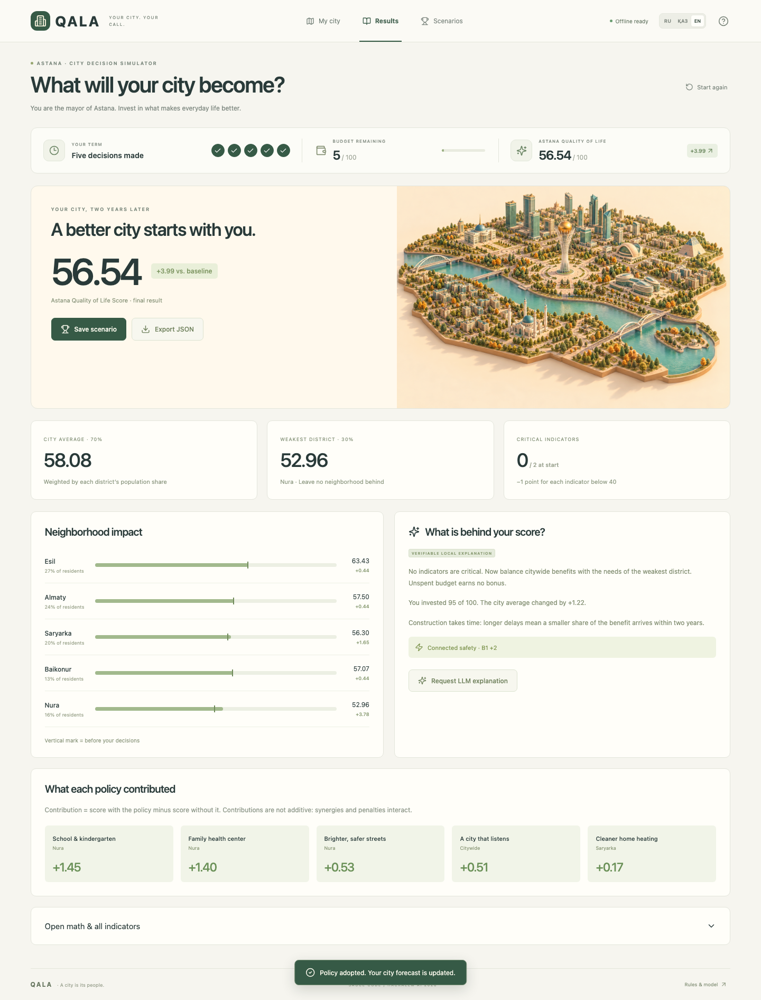

<div align="center">

# QALA

### One city. Five decisions. A better everyday life.

**An offline-first, turn-based Astana city simulator by Sauce Code.**

[English](README.md) · [Русский](README.ru.md) · [Қазақша](README.kk.md)

[Play offline](#play-in-30-seconds) · [The rules](#a-fair-start-a-transparent-result) · [How it works](#built-for-trust) · [Demo walkthrough](docs/DEMO.md)

**100 budget · 5 decisions · 5 districts · 14 policies · 3 languages**



*HackAlem AI 2026 · “Virtual Mayor for 5 Hours” · Case owner: Astana Innovations*

</div>

## A city is its people

A new park feels like an easy choice. Until you discover that the same land could hold a school, the growing district needs a clinic, and your budget must cover five decisions.

QALA turns a policy spreadsheet into a small, understandable strategy game. Explore a miniature Astana, preview a policy, choose its district, and see who benefits. Finish with an **Astana Quality of Life Score** you can inspect down to every indicator.

The game borrows district exploration from Civilization, card synergies from Balatro, and readable consequences from Plague Inc. The scoring follows the supplied case dataset exactly.

## Play in 30 seconds

**No account. No API key. No server. No internet required to play the downloaded game.**

1. Download [play/QALA.html](play/QALA.html) using GitHub’s **Download raw file** button. Alternatively, download the repository ZIP.
2. Open `QALA.html` in a modern desktop browser.
3. Choose RU, EN, or ҚАЗ. Inspect Nura, explore a school or clinic card, and make your first decision.

All JavaScript, Three.js, styles, data, and artwork are inside the HTML. Opening a local file works on the first launch, without a prior online visit. Browser storage preserves your current game when permitted; JSON export works independently. On devices without WebGL, an illustrated map preserves the full game.

For development, use Node.js **22 or newer**:

```bash
npm ci
npm run dev
```

Open the local URL printed by Vite. Installing dependencies requires internet; the built game does not.

```bash
npm run check       # Engine/API adapter tests + TypeScript + production build
npm run test:e2e    # Full browser games, offline, mobile, validation and fallback
npm run package    # Build the downloadable play/QALA.html
```

Install the browser once if needed: `npx playwright install chromium`.

## Make a choice. Understand its cost.

| Feature | Why it matters |
|---|---|
| Interactive Three.js city | Five selectable districts, score overlay, visible policy markers, orbit and zoom |
| Fourteen policy cards | Cost, implementation delay, target, and actual two-year effects before committing |
| Five-decision game | Budget and conflict checks, undo, and a guard against impossible-to-finish plans |
| Policy synergies | Bus lanes + signals, lighting + digital requests, cleaner fuel + green belt |
| Transparent results | Population-weighted score, weakest district, critical penalties, all 50 indicators |
| Local advisor | Deterministic, explainable advice works offline; legal next moves are ranked by immediate gain |
| Optional LLM narration | A server passes verified engine output to an LLM for a plain-language explanation |
| Replay and compare | Save up to ten scenarios in your browser; export the complete calculation as JSON |
| RU / EN / ҚАЗ | Localized game controls, policy descriptions, help and results |



## A fair start. A transparent result.

Everyone starts with the same **100 budget** and the same synthetic district data. Adopt **exactly five unique policies**, with **at most two per category**. City policies affect every district; local policies require one district. All supplied incompatibilities are enforced. Unspent budget earns no bonus.

Each turn is a decision, not another elapsed quarter. Policies share an eight-quarter simulation horizon, so **decision order never changes the final result**.

```text
indicator' = clip(base + Σ fullEffect × (8 − delay) / 8 + synergies, 0, 100)
district   = Σ indicatorWeight × indicator'
city       = Σ populationShare × district
Score      = 0.70 × city + 0.30 × weakestDistrict − criticalCount
```

A critical indicator is **strictly below 40**. Fixed synergy bonuses are not reduced by delay. The weakest-district term rewards inclusive improvement rather than concentrating all investment in the strongest neighborhood. Invalid final scenarios receive **no score**; partial results are labeled forecasts.

The supplied baseline reproduces as **52.55768**. The official example (`M7 Nura, M8 Nura, M10 Nura, M12 city, M5 Saryarka`) costs **95** and scores **56.54307**. No sample totals are hard-coded into the engine.



## Built for trust

```text
Policy cards → validator → deterministic simulation → result + explanation context
                              ↓                         ↓
                    Three.js city + report       local advisor (offline)
                                                optional LLM (server only)
```

**React + TypeScript + Vite + Three.js.** No database or runtime CDN. Lucide icons and original generated Astana key art are bundled locally. Vite’s single-file build makes the game portable.

| Location | Responsibility |
|---|---|
| `src/game/data.ts` | Supplied district values, weights, policies, translations and synergies |
| `src/game/engine.ts` | Validation, simulation, completion search, recommendations and contributions |
| `src/game/explanation.ts` | Verified explanation context; no model-owned numbers |
| `src/components/CityMap.tsx` | Three.js scene, picking, effects, cleanup and illustrated fallback |
| `src/App.tsx` | Card game, previews, reports, language selection and local scenario archive |
| `server/advisor.ts` | Optional local OpenAI Responses API adapter; recomputes all input server-side |
| `tests/` | Scoring invariants, official example, permutations, seeded runs and browser journeys |

### Optional real LLM explanation

The default offline advisor is **rule-based, not an LLM**. To enable generated explanations:

```bash
cp .env.example .env
# Set OPENAI_API_KEY in .env. Do not use a VITE_ prefix.
npm run build
npm start
```

Open `http://localhost:8787`, finish a scenario, and click **Request LLM explanation**. The configurable default is `gpt-4.1-mini`. The server computes the score itself, then sends only synthetic scenario data to the [OpenAI Responses API](https://developers.openai.com/api/docs/guides/text). The model explains strengths, tradeoffs and consequences; it cannot change the displayed score. Keys stay on the server. Provider failure preserves the local report.

The adapter is tested with mocked provider responses. A live call requires your key and connectivity and has **not been verified in this build**. The server binds to localhost and is a demo integration, not an authenticated public service.

## Reproducibility is part of the product

Tests verify the reference result, all policy scopes/delays, all three synergies, strict critical thresholds, all 120 permutations of the sample scenario, invalid sets, budget dead ends, and 60 seeded legal playthroughs. Browser tests play all five turns, reload saved state, export JSON, check mobile/Kazakh UI, exercise conflicts, and play from `file://` with networking disabled.

Hourly checkpoints run `npm run check` before committing meaningful work and pushing. Run `npm run checkpoint` manually when ready. The helper refuses conflicts, unexpected remotes and likely credential files; it never creates empty commits or force-pushes. The scheduled desktop task additionally reviews changes and ends after the hackathon window.

- [Five-hour implementation plan](docs/PLAN.md)
- [Model specification and assumptions](docs/MODEL.md)
- [Two-minute judge walkthrough](docs/DEMO.md)
- [Original supplied dataset](docs/supplied-dataset.ru.txt)
- [Artwork provenance and generation prompt](docs/ASSETS.md)

## Scope and next steps

This is an educational simulation with **synthetic data and an illustrative map**, not real district geometry or a forecast of municipal outcomes. Visual markers communicate adopted policies; policy benefits follow the supplied fixed effects. The local recommendation is a greedy next-step suggestion, not a proven globally optimal plan.

The first version deliberately keeps random events out of the judged scenario so every comparison is fair. Next: a separate event sandbox, stronger scenario optimization, real GIS layers, scenario import, and a shared leaderboard.

Built by **Sauce Code** with Codex for [HackAlem AI](https://hackalem.ai/).
