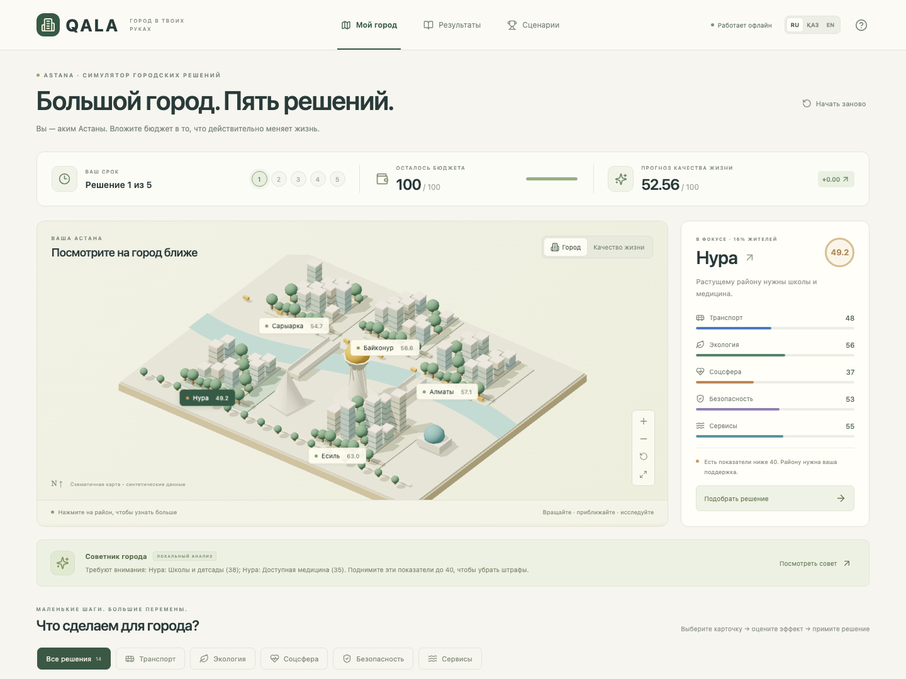

<div align="center">

# QALA
### Большой город. Пять решений.
**Пошаговый симулятор Астаны, который работает офлайн.**

[English](README.md) · [Русский](README.ru.md) · [Қазақша](README.kk.md)

**100 единиц бюджета · 5 решений · 5 районов · 14 мер · 3 языка**



*Sauce Code · HackAlem AI 2026 · «Аким на 5 часов» · Astana Innovations*
</div>

## Город — это люди

Построить парк кажется простым решением. Пока не выясняется, что тот же участок нужен школе, новому району не хватает поликлиники, а бюджета должно хватить на пять решений.

QALA превращает таблицу городских показателей в понятную стратегическую игру. Изучайте районы, выбирайте карточки проектов и заранее смотрите последствия. В конце получите **Astana Quality of Life Score** с разбором до каждого показателя.

От Civilization — исследование районов. От Balatro — карточки и синергии. От Plague Inc — наглядные последствия. Математика соответствует выданному датасету.

## Начните за 30 секунд

1. Скачайте [play/QALA.html](play/QALA.html) кнопкой **Download raw file** на GitHub или скачайте ZIP репозитория.
2. Откройте файл в современном браузере. Установка, интернет, аккаунт и API-ключ не нужны.
3. Выберите район, рассмотрите меру и примите первое решение.

Код, Three.js, стили, данные и изображение включены в один HTML. Офлайн работает даже при первом открытии. Если WebGL недоступен, остаётся иллюстрированная карта и вся игровая логика. Текущая партия сохраняется в браузере, если его настройки разрешают; результат можно экспортировать в JSON.

Для разработки нужен Node.js 22+:

```bash
npm ci
npm run dev
```

```bash
npm run check       # Тесты, TypeScript и сборка
npm run test:e2e    # Браузерные сценарии, офлайн и мобильная версия
npm run package    # Готовый play/QALA.html
```

При необходимости установите тестовый браузер: `npx playwright install chromium`. Интернет нужен для установки зависимостей, но не для готовой игры.

## Что умеет QALA

- Интерактивная Three.js-карта: пять районов, вращение, масштабирование, слой качества жизни и отметки принятых мер.
- Четырнадцать карточек с ценой, задержкой, эффектом за два года и выбором района.
- Пять ходов, контроль бюджета, запрет конфликтов, отмена последнего решения и защита от невозможности завершить партию.
- Три синергии: полосы + светофоры, освещение + обращения, чистое топливо + зелёный пояс.
- Прозрачный отчёт: средний балл, слабейший район, штрафы, все 50 показателей и вклад каждой меры.
- Локальный советник, сохранение до десяти сценариев, сравнение и экспорт JSON.
- Русский, английский и казахский интерфейсы; опциональное объяснение от LLM.

## Правила без скрытой магии

У всех **100 единиц** бюджета и одинаковые синтетические данные. Нужно **ровно пять уникальных мер**, не более двух в одном направлении. Районная мера требует район; городская действует везде. Несовместимости проверяются автоматически. Остаток бюджета не даёт бонуса.

Каждый ход — выбор, а не прошедший квартал. Горизонт всех мер — восемь кварталов, поэтому порядок решений не меняет результат.

```text
Показатель = clip(база + Σ эффект × (8 − лаг) / 8 + синергии, 0, 100)
Район      = Σ вес показателя × показатель
Город      = Σ доля населения × балл района
Score      = 0.7 × город + 0.3 × слабейший район − критические показатели
```

Критический показатель — строго ниже 40. Бонусы синергии фиксированы и не уменьшаются из-за лага. Невалидный набор не получает итоговый Score; до пяти решений показывается только прогноз.

База: **52.55768**. Пример организаторов (`M7 Нура, M8 Нура, M10 Нура, M12 город, M5 Сарыарка`) стоит **95** и даёт **56.54307**. Числа вычисляются из исходных показателей, а не подставляются.

## Как устроен проект и где AI

**React + TypeScript + Vite + Three.js.** Чистый модуль `src/game/engine.ts` валидирует решения и считает все числа. Интерфейс и карта читают его результат. База данных и CDN не нужны; сборка упаковывает приложение в один HTML.

**Офлайн-советник использует правила, а не LLM.** Он объясняет критические показатели и предлагает допустимый следующий ход по немедленному приросту Score. Это не доказанный глобальный оптимум.

Для настоящего LLM-разбора:

```bash
cp .env.example .env
# Укажите OPENAI_API_KEY в .env, без префикса VITE_.
npm run build
npm start
```

Откройте `http://localhost:8787` и нажмите «Запросить LLM-разбор» в отчёте. Сервер заново вычисляет результат и передаёт модели проверенные данные. По умолчанию используется настраиваемая `gpt-4.1-mini` через OpenAI Responses API. LLM объясняет последствия и компромиссы; отображаемый балл ему не принадлежит. Ключ остаётся на сервере. При ошибке остаётся локальный разбор.

Интеграция проверена на имитации ответов провайдера; реальный вызов с API-ключом **в этой сборке не проверялся**. Сервер слушает только localhost и предназначен для демонстрации.

## Проверка и развитие

Тесты покрывают формулу, официальный пример, лаги, синергии, несовместимости, порог 40, все 120 перестановок примера и 60 воспроизводимых партий. Браузерные проверки проходят пять ходов, проверяют сохранение, экспорт, мобильный интерфейс, отсутствие WebGL и первый запуск HTML без сети.

`npm run checkpoint` проверяет проект, фиксирует завершённые изменения и отправляет их в командный репозиторий без force-push и пустых коммитов.

Данные синтетические; карта не повторяет реальные границы районов. Это учебная модель, не прогноз реальной Астаны. Следующие шаги: отдельная песочница со случайными событиями, оптимизация сценариев, GIS и общая таблица результатов.

[План на пять часов](docs/PLAN.md) · [Модель](docs/MODEL.md) · [Демо для жюри](docs/DEMO.md) · [Исходный датасет](docs/supplied-dataset.ru.txt)
